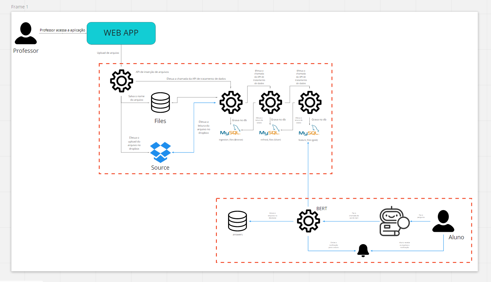

# profressor-virtual
[](https://github.com/FAST-PROJ/professor-virtual/blob/master/LICENSE)
[](http://makeapullrequest.com)

>Este repositório contém o código fonte do trabalho de conclusão de curso apresentado ao Centro Universitário Senac - Campus Santo Amaro.
O projeto tem por finalidade auxiliar professores na condução de aulas online.

## Arquitetura inicial do projeto


### URL da API
**https://spv-etl.herokuapp.com**

### Endpoints

#### Upload de um PDF
> Essa API insere um registro na tabela text.files, para isso, será necessário passar o nome do arquivo como parâmetro.

```python
URI: 'https://spv-etl.herokuapp.com/insertFiles'
METHOD: POST
HEADERS: []
BODY: {
    "file_name":"nome_do_arquivo",
    "file_content":"JVBERi0xLjUKJYCBgoMKMSAwGCg==..."
}
```

#### Processando os arquivos PDF's
Essa API insere os textos nas tabelas segmentadas por nivel de tratamento dos textos, para isso, será necessário passar o id do arquivo da tabela text.files como parâmetro.
```python
URI: 'https://spv-etl.herokuapp.com/processFiles'
METHOD: POST
HEADERS: []
BODY: {
    "id":"25"
}
```